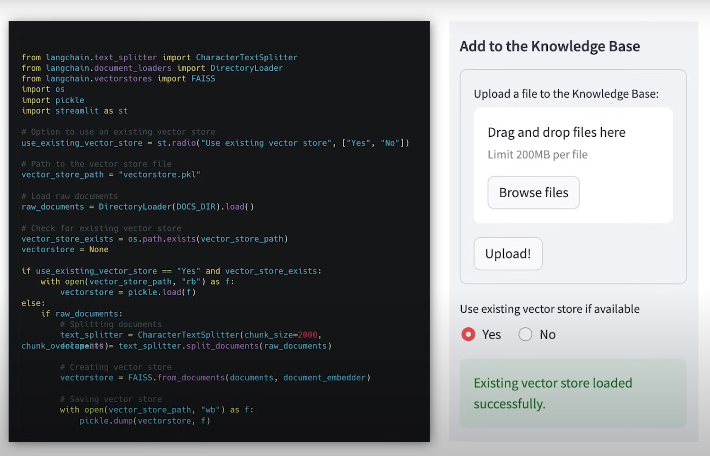
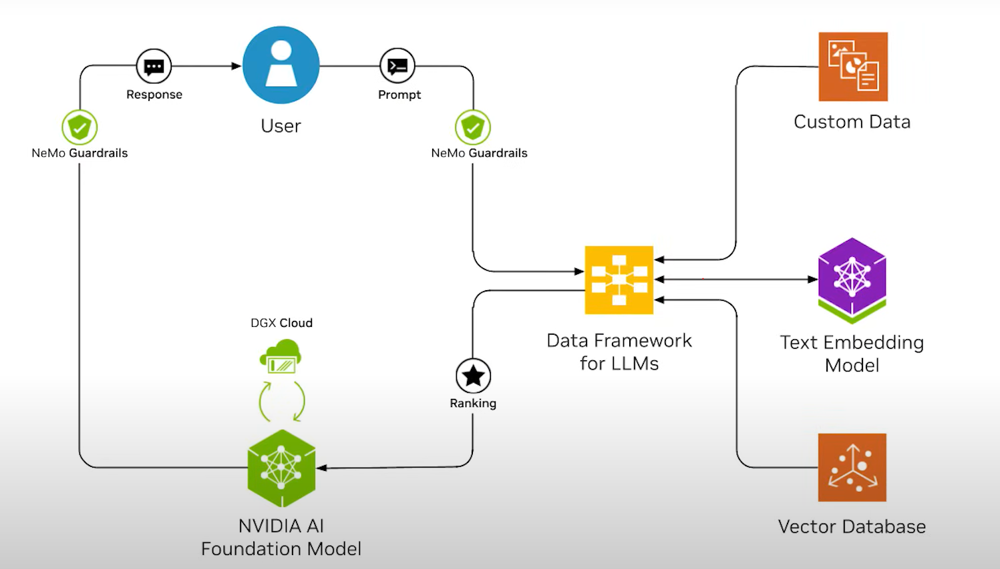
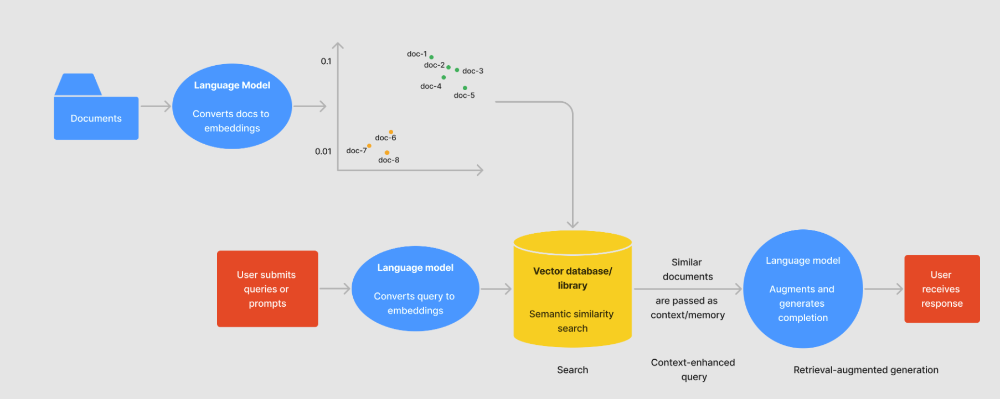
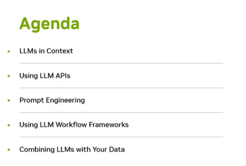
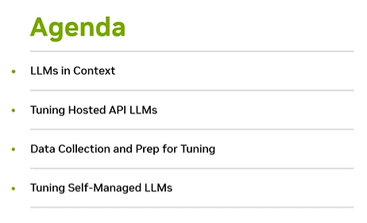
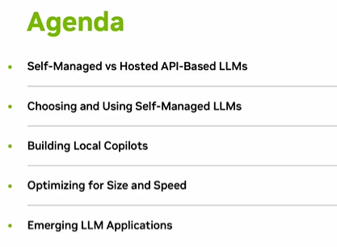
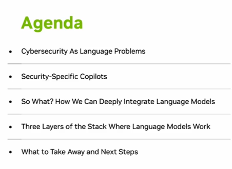

# Build a retrieval augmented generated (RAG) model
Figuring out how to build a RAG model to submit to the below contest (submissions due June 17, 2024). The submission just has to use NVIDIA technologies and Langchain. They'd prefer you to use their endpoints but from what I gather, if you can prove how you use NVIDIA technologies, they'll consider your submission.
- [How does RAG work in 60 seconds](https://youtube.com/shorts/xS55duPS-Pw?si=VjVI12iVxdDdy5Xc)
- [What is LangChain?](https://youtu.be/1bUy-1hGZpI?si=WMVdGpjGJWcwUeBv)
- https://www.nvidia.com/en-us/ai-data-science/generative-ai/developer-contest-with-langchain/ 
- https://developer.nvidia.com/generative-ai-agent-contest-registration/thank-you 
- https://developer.nvidia.com/blog/generative-ai-agents-developer-contest-top-tips-for-getting-started 
- https://github.com/NVIDIA/GenerativeAIExamples
- https://docs.nvidia.com/nemo/guardrails/user_guides/llm/nvidia_ai_endpoints/README.html

## [Build a Retrieval-Augmented Generation Chatbot in 5 Minutes](https://youtu.be/N_OOfkEWcOk?si=PO--ZS2-ro-H8fYG)
[source code](https://github.com/NVIDIA/GenerativeAIExamples/blob/main/examples/5_mins_rag_no_gpu/main.py)

## [Large Language Models: Application through Production](https://learning.edx.org/course/course-v1:Databricks+LLM101x+2T2023/home)

The above diagram is an explainer from databricks about how RAG databases work from the edx course. The include LLM files will only run in databricks. 

### [2.7.1 Notebook Demo Part 1](https://learning.edx.org/course/course-v1:Databricks+LLM101x+2T2023/block-v1:Databricks+LLM101x+2T2023+type@sequential+block@d230efabe642484cb7f8cf9b23f8cad4/block-v1:Databricks+LLM101x+2T2023+type@vertical+block@098cf1bc67924d6dbac16d6ff3fc5cc9)
- [the source code for the notebook is found here](https://github.com/sprintup/large-language-models/blob/08a6ae43bce7d8ad138e7bf1890216d0273aa689/LLM%2002%20-%20Embeddings%2C%20Vector%20Databases%2C%20and%20Search/LLM%2002%20-%20Embeddings%2C%20Vector%20Databases%2C%20and%20Search.py#L14C470-L14C623)
## Misc Resources
- https://abvijaykumar.medium.com/ollama-build-a-chatbot-with-langchain-ollama-deploy-on-docker-5dfcfd140363
- [What is a Vector Database?](https://www.youtube.com/watch?v=t9IDoenf-lo)
- [Langchain docs](https://python.langchain.com/v0.2/docs/introduction/)
- [LM Studio](https://lmstudio.ai/)
- [Hugging Face](https://huggingface.co/)
- [Databricks](https://www.databricks.com/)
- [Using `generate_events_async` and Streaming](https://github.com/NVIDIA/NeMo-Guardrails/blob/develop/examples/notebooks/generate_events_and_streaming.ipynb)
- NVIDIA LLM Developer Day Videos
  - [The Fast Path to Developing with LLMs](https://event.on24.com/wcc/r/4371300/9C96C2D84F0E9BB46E757F807129A8C3)
    - 
  - [Tailoring LLMs to Your Use Case](https://event.on24.com/wcc/r/4371524/02081723A09362868B14957B07C4F01C)
    - 
  - [Large Language Models and Generative AI for Life Sciences](https://event.on24.com/wcc/r/4390803/017BA6B34D53EB796D3D3BFE36D3FCFB)
  - [Running Your Own LLM](https://event.on24.com/wcc/r/4371549/0AF4CBAA6515D4EC0FFEE49E90C3B2C7)
    - 
  - [Reinventing the Complete Cybersecurity Stack With AI Language Models](https://event.on24.com/wcc/r/4390810/FDC5E74A0029E3B32C3543246BBA7356)
    - 
  - [Technical Ask-the-Experts](https://event.on24.com/wcc/r/4371579/02DC8E8C6C6D7B0BD739E97DAE97BAC0)
